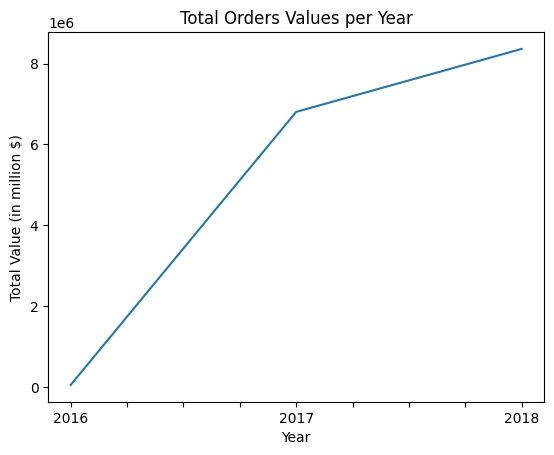
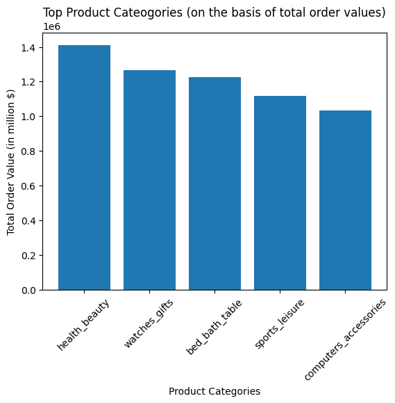
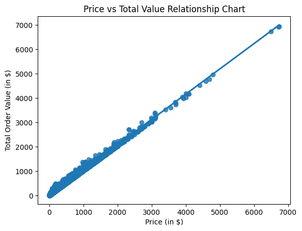

# 📊 Olist E-commerce Data Visualization & Insights Dashboard

## Overview

This project focuses on building an **insight-driven visualization dashboard** using the Olist Brazilian e-commerce dataset.

The objective is to transform structured transactional data into **clear, actionable insights** through visual analysis, enabling better understanding of revenue trends, product performance, and pricing behavior.

---

## Business Problem

E-commerce platforms generate large volumes of transactional data, but raw data alone does not provide actionable insights.

This project addresses:

* How revenue evolves over time
* Which product categories drive the most business value
* How pricing and freight impact overall order value
* How data can be visualized for intuitive decision-making

---

## Dataset

* **Source:** Kaggle
  https://www.kaggle.com/datasets/olistbr/brazilian-ecommerce

* Contains multiple relational datasets including:

  * Orders
  * Order Items
  * Products
  * Product Category Translations

---

## Data Preparation

This project builds on prior data transformation work:

🔗 **Data Wrangling Repository:**
https://github.com/RaghavBhardwaj18/olist-ecommerce-data-wrangling

* Merged multiple datasets into a unified structure
* Derived `total_value = price + freight_value`
* Filtered relevant transactions (delivered orders)

---

## Approach

### 1. Revenue Analysis

* Aggregated total order value over time
* Visualized:

  * Total revenue per year
  * Average order value trends



---

### 2. Product Category Analysis

* Ranked categories based on total revenue
* Identified top-performing product categories
* Visualized category contribution using bar charts



---

### 3. Price Distribution & Correlation Analysis

* Analyzed distribution of product prices  
* Explored relationship between:
  * Product price  
  * Total order value  

* Used:
  * Histograms (distribution trends)  
  * Scatter + regression plots (correlation insights)  



---

### 4. Category vs Price Insights

* Computed category-level metrics:

  * Average price
  * Total revenue
* Used heatmaps to compare categories across dimensions
* Identified high-value categories and pricing patterns

---

## Key Insights

* Revenue trends reveal growth patterns over time
* A small set of categories contributes significantly to total revenue
* Price and total order value show strong correlation
* Distribution analysis highlights variability and potential outliers
* Category-level comparisons provide insights into pricing strategies

---

## Outcome

The project delivers a **visual analytics layer** on top of structured e-commerce data, enabling:

* Better understanding of business performance
* Identification of high-value categories
* Insight into pricing and revenue dynamics

---

## Tools & Technologies

* Python
* Pandas
* Matplotlib
* Seaborn

---

## Project Structure

```bash id="olist-viz-structure"
olist-ecommerce-visualization/
│
├── olist-brazilian-ecommerce-data-visualization.ipynb
├── datasets/
    └── datasets_source.txt
├── assets/
    ├── revenue_over_time.png
    ├── top_categories.png
    ├── price_distribution.png
    ├── boxplot_values.png
    ├── price_vs_totalvalue.png
    └── category_heatmap.png
```

---

## Conclusion

This project demonstrates how visualization transforms processed data into meaningful business insights. It highlights the importance of combining data preparation with analytical storytelling in real-world data science workflows.

---

## Note

This repository focuses on **data visualization and insight generation**.
Data wrangling and preprocessing are handled separately in the linked repository above.
